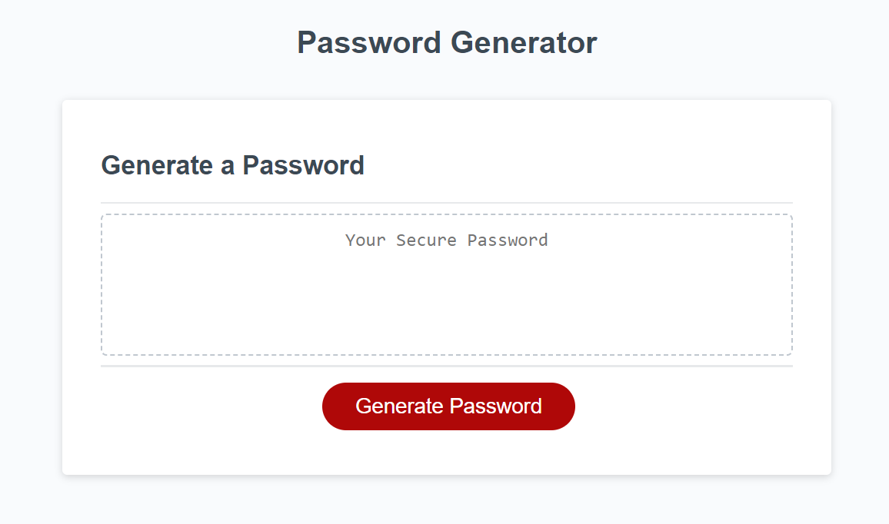

# urban-tribble-module-03-challenge
Module 03 Challenge

## Description

This web application is a random password generator.  It is designed to take input from the user and then generate a random password.
Users can specify the number of characters and types of characters they wish to use.

## Installation

N/A

## Usage

This application can be accessed at this URL: 

Click on the Generate Password button to begin the process of generating a password.  First, enter the number of characters that you wish for the password to be.
You are limited to between 8 and 128 characters.  Next, select the types of characters that you would like to use for the password.  After doing so, your password will generate and be displayed.

Random password generator screenshot:

## Credits

N/A

## License

N/A